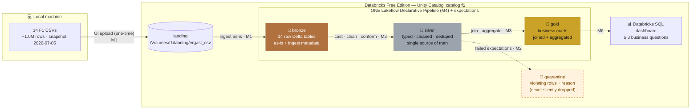

# Architecture & Flow — F1 Medallion Lakehouse

> **Read this first.** This is the north-star document: the whole project on one page, drawn before any
> code is written. Every milestone (M1–M7) builds exactly one piece of this picture — if a step ever
> doesn't fit this diagram, the step is wrong, not the diagram.
>
> Diagrams are **Mermaid** (rendered natively by GitHub). An [eraser.io version](architecture.eraser)
> of the main flow exists for slide-quality exports.

---

## 1. The story in one paragraph

We start with **14 CSV files on a laptop** — the complete history of Formula 1, 1950 → today, ~1.0M rows.
They're honest but untrustworthy: everything is a string, missing values are spelled `\N`, and nothing
enforces that a result points at a real race. We end with a **governed lakehouse**: a dashboard answering
real questions (*who dominated each era? how have pit stops evolved?*), where every number on screen can
be traced backwards — Gold mart → trusted Silver row → raw Bronze copy → original CSV. The medallion
architecture is that journey, made explicit as three layers with rules.

## 2. The big picture



Rules the arrows obey (from the [constitution](../planning/constitution.md)):

- Data flows **forward only** — never backward, never skipping a layer.
- Bronze is **immutable**: if Silver logic changes, we re-run from Bronze; we never re-upload or edit raw.
- Rows that fail a quality expectation go to **quarantine with a reason** — so row accounting always
  closes: `bronze count = silver count + quarantine count`, per table.
- The whole B→S→G flow is **one** declarative pipeline (M4) — one button rebuilds everything.

## 3. Follow one real row through the lakehouse

The best way to understand the layers is to watch what happens to a single row. This is the actual first
row of `results.csv` — **Lewis Hamilton winning the 2008 Australian Grand Prix for McLaren**:

```
1,18,1,1,22,1,1,1,1,10,58,1:34:50.616,5690616,39,2,1:27.452,218.3,1
```

| Stage | What the row looks like | What happened |
|-------|-------------------------|---------------|
| **CSV** | 18 comma-separated fields, all text. `1:34:50.616` is a string; a DNF row here would say `\N` for position. | Nothing yet — this is the source. |
| 🥉 **Bronze** `f1.bronze.results` | Same 18 fields, still strings, **plus** `_source_file = "results.csv"`, `_ingested_at = <timestamp>`. | Copied as-is. If we ever doubt a downstream number, this is the untouched evidence. |
| 🥈 **Silver** `f1.silver.results` | `result_id=1 INT` · `points=10.0 DOUBLE` · `milliseconds=5690616 BIGINT` · `position=1 INT` *(nullable — `\N` becomes real NULL for DNFs)* · FKs verified: `race_id=18` exists in `silver.races` (2008 Australian GP), `driver_id=1` → Hamilton, `constructor_id=1` → McLaren, `status_id=1` → "Finished". | Typed, validated, trusted. A row failing these checks would be sitting in `f1.quarantine.results` with a reason instead. |
| 🥇 **Gold** e.g. `f1.gold.driver_season_summary` | One aggregated row: `driver="Lewis Hamilton", season=2008, wins=…, podiums=…, points=…` — this result contributed `wins+1, points+10`. | Joined with drivers/races and aggregated. Small, fast, dashboard-ready. |

> Note the 10 points for a win — that's the pre-2010 scoring system, a nice reminder that this data
> spans 77 seasons of changing rules. Gold marts must aggregate *recorded* points, not assume today's 25.

## 4. Table-level map — 14 raw tables → trusted model → marts

```mermaid
flowchart LR
    subgraph BR["🥉 bronze (14 tables, raw)"]
        direction TB
        b1["races · results · sprint_results"]
        b2["drivers · constructors · circuits<br/>seasons · status"]
        b3["qualifying · lap_times · pit_stops"]
        b4["driver_standings · constructor_standings<br/>constructor_results"]
    end

    subgraph SV["🥈 silver (typed & conformed)"]
        direction TB
        s1["facts: results, qualifying,<br/>lap_times, pit_stops, standings"]
        s2["dimensions: races, drivers,<br/>constructors, circuits, status, seasons"]
    end

    subgraph GD["🥇 gold (marts — final list locked in M3 spec)"]
        direction TB
        g1["driver_season_summary"]
        g2["constructor_season_summary"]
        g3["pit_stop_evolution"]
        g4["circuit_stats"]
    end

    BR --> SV --> GD

    style BR fill:#B0713F22,stroke:#B0713F
    style SV fill:#9BA3AD22,stroke:#9BA3AD
    style GD fill:#C9A22722,stroke:#C9A227
```



Why this shape: the Ergast schema is already relational (real foreign keys: `raceId`, `driverId`,
`constructorId`, `circuitId`, `statusId`). Silver's job is to make those relationships *actually hold*
(typed keys + referential checks), so Gold can join freely without defensive code.

## 5. What each layer is *for* (the "why", not just the "what")

| Layer | Job | F1-specific work | What would go wrong without it |
|-------|-----|------------------|-------------------------------|
| `landing` volume | Get files into governed storage | One-time UI upload of the 14 CSVs (Free Edition blocks cluster internet) | No governed home for raw files; ad-hoc paths everywhere |
| 🥉 `bronze` | Preserve the source, forever | 1 CSV → 1 Delta table, all strings, + `_source_file`, `_ingested_at` | Any cleaning bug becomes unrecoverable — you'd have to trust the transformed data or re-upload |
| 🥈 `silver` | Make data trustworthy | `\N`→NULL · cast dates/numerics · keep `milliseconds` as numeric truth over time-strings · dedupe on natural keys · verify FKs · distinguish *scheduled* 2026 races from *raced* ones | Dashboards silently built on strings, fake `\N` values, and orphaned foreign keys |
| 🚧 `quarantine` | Keep the evidence of bad rows | Failed rows land here **with a reason column**; counts reconcile to Bronze | Bad rows vanish silently; nobody can say how many or why |
| 🥇 `gold` | Answer business questions fast | Small joined aggregates: seasons, drivers, constructors, pit stops | Every dashboard query re-joins a 876K-row lap_times table |
| DLT pipeline (M4) | Reproducibility | The whole B→S→G graph declared once; expectations native; full-refresh rebuilds identical Gold | A pile of notebooks that must be run by hand, in the right order, from memory |
| Unity Catalog (M5) | Governance | Comments, tags, grants on `f1.*` | Tables nobody can find, understand, or safely share |
| SQL dashboard (M6) | The payoff | ≥3 business questions answered from Gold | All this plumbing with nothing visible to show for it |

## 6. Why each technology is here

| Technology | Role | Why it (and not something else) |
|-----------|------|--------------------------------|
| **Delta Lake** | Table format for every layer | ACID writes, schema enforcement, time travel (`VERSION AS OF`) = rollback for free |
| **Unity Catalog** | Governance root | One namespace (`f1.<schema>.<table>`), comments/tags/grants, lineage |
| **UC Volume** | Raw-file landing zone | The governed way to hold *files* (not tables) — and the only ingestion route Free Edition allows |
| **PySpark** | Transformation language | Industry default; the skills transfer to any Spark platform |
| **Lakeflow DLT** | Orchestration | Declare tables + expectations; Databricks works out the DAG, retries, and metrics |
| **Databricks SQL** | Serving | Dashboard directly on Gold Delta tables; 2X-Small warehouse fits the free tier |
| **GitHub** | Source of truth | Specs + code versioned; workspace mirrors the repo via Git folders — no copy-paste drift |

## 7. The build order (roadmap)


Each milestone = one spec written **before** the code, then implemented, then **verified against its
acceptance criteria** before it's marked done. M1–M3 build the layers as notebooks (so we learn each
transformation hands-on); M4 then re-expresses the same logic as the single declarative pipeline —
learning first, automation second.

---

*Companion docs: [`planning/overview.md`](../planning/overview.md) (dataset detail) ·
[`planning/masterplan.md`](../planning/masterplan.md) (deployment runbook) ·
[`PLAN-AND-PROGRESS.md`](../PLAN-AND-PROGRESS.md) (current status).*
