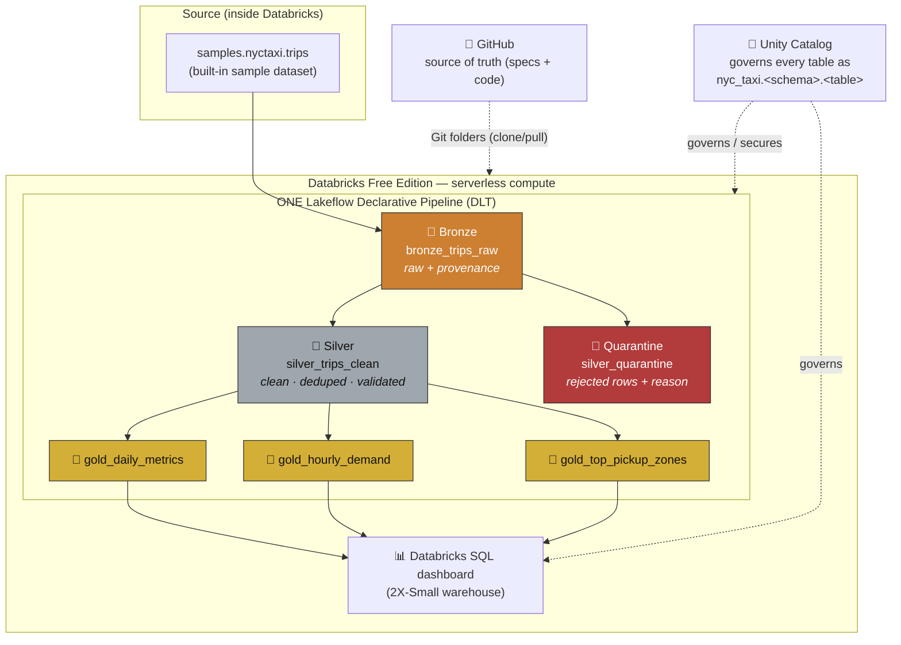

# Architecture — Medallion Lakehouse on Databricks

> **The one diagram a reviewer opens first.** It shows every component, how they
> communicate, and *why each technology is here*. Detailed data/pipeline/execution views
> live in the sibling docs linked at the bottom.

---

## 1. Overall architecture diagram

**How to read it (for a plain-text viewer):** data starts at the built-in `samples.nyctaxi.trips`
table, is copied untouched into **Bronze**, cleaned/validated into **Silver** (bad rows peel off into
**Quarantine**), aggregated into three **Gold** marts, and served to a **SQL dashboard**. Everything
inside the dashed box runs as *one* DLT pipeline on serverless compute. **Unity Catalog** governs every
table; **GitHub** is where the code actually lives and is pulled into the workspace via Git folders.

---

## 2. How the components communicate

| From → To | Mechanism | What crosses the boundary |
|-----------|-----------|---------------------------|
| `samples.nyctaxi.trips` → Bronze | `spark.read.table(...)` inside the pipeline | Raw rows (read-only source) |
| Bronze → Silver / Quarantine | Pipeline dataset dependency (`spark.read.table("bronze_trips_raw")`) | Deduped rows split by validity |
| Silver → Gold ×3 | Pipeline dataset dependency | Clean rows, grouped/aggregated |
| Gold → Dashboard | SQL query over `nyc_taxi.medallion.gold_*` on the SQL warehouse | Business metrics |
| GitHub ↔ Workspace | **Databricks Git folders** (clone/pull/commit) | Specs + `src/` code (no copy-paste drift) |
| Unity Catalog ↔ everything | Namespace + access control | Every table is `nyc_taxi.<schema>.<table>` |

The pipeline never talks to the outside internet, and data never leaves the workspace — a deliberate
consequence of Free Edition's restrictions (see the constitution, Principle VI).

---

## 3. Every technology — *why it's here* (instruction #2)

This is the table to have open during the demo. Each row answers: **why**, **what problem it solves**,
**the simpler alternative**, and **why we didn't use it**.

| Technology | Why it's used / problem it solves | Simpler alternative | Why not the alternative |
|------------|-----------------------------------|---------------------|-------------------------|
| **Medallion architecture** (Bronze/Silver/Gold) | Gives data a clear, one-directional path from *raw* → *trusted* → *business-ready*. Each layer has one job, so lineage and trust are obvious. | Dump everything into one "clean" table | One table mixes raw and derived data — you lose the audit trail, can't reprocess, and a bad transform corrupts your only copy. Layering isolates blast radius. |
| **Databricks (Free Edition)** | Managed lakehouse: Spark + Delta + governance + orchestration + SQL in one place, zero infra to run. | Install Spark locally / a laptop notebook | Local Spark has no Unity Catalog, no DLT, no managed Delta, no SQL warehouse, and doesn't reflect how this is built in industry. Free Edition is "free forever" and mirrors the real product. |
| **Delta Lake** (table format) | ACID transactions, schema enforcement, **time travel** (`VERSION AS OF`), and it's the native format DLT/UC expect. | Parquet / CSV files | Plain files have no ACID, no schema enforcement, no versioned rollback — a half-written job leaves corrupt data and no way back. |
| **Lakeflow Declarative Pipelines (DLT)** | You *declare* the tables and their dependencies; DLT builds the DAG, runs them in order, tracks lineage, and enforces **expectations** with visible pass-rates. One reproducible run rebuilds everything. | Hand-ordered notebooks / scripts | With scripts *you* own run-order, retries, lineage, and data-quality wiring by hand — easy to get wrong and impossible to reproduce cleanly. DLT makes reproducibility and DQ first-class. |
| **DLT expectations** | Data-quality rules as *executable code* (`@dp.expect_all_or_drop`) with pass-rate metrics in the UI — the contract is enforced, not hoped for. | `if`/manual `assert` checks | Manual checks are scattered, silent, and produce no metrics. Expectations centralize the contract and report it. |
| **Unity Catalog** | Single governance layer: `catalog.schema.table` naming, access control, and lineage across all tables. | Hive metastore / raw paths | Hive metastore is per-workspace and ungoverned; raw paths have no access control or lineage. UC is the modern, governed default. |
| **PySpark** | Distributed dataframe engine — the same code runs on 21k rows or 21B rows. Expressive transforms (dedupe, window, aggregate). | pandas | pandas is single-machine and blows up past memory. The whole point of a lakehouse is horizontal scale; PySpark provides it. |
| **Databricks SQL + warehouse** | Fast, BI-style querying and dashboards directly on the governed Gold tables. | Export to a spreadsheet | Spreadsheets go stale, don't scale, and break governance/lineage. A SQL dashboard queries the live Gold tables. |
| **GitHub** | Version control + the source of truth; enables spec-first history and pulling code into the workspace via Git folders. | Keep notebooks only in the workspace | Workspace-only code has no history, no review, and is *trapped* if compute is unavailable. Git keeps everything portable and reviewable. |
| **GitHub Spec Kit** (`.specify/`) | Provides the **constitution** concept (governing principles) that this project's specs comply with — spec-first discipline. | Ad-hoc README notes | Notes drift; a versioned constitution + per-milestone specs make every decision traceable and defensible. |

> **Note on tools we deliberately did *not* add** (instruction #1 / #8): no Airflow, no dbt, no Docker,
> no Terraform, no Azure DevOps, no CI/CD. Each would be *unjustified complexity* for a single-owner,
> single-workspace, batch project on Free Edition. Their real-world roles and *why they'd only be added
> at scale* are covered in [execution-flow.md](execution-flow.md) and the future-work section of
> [`planning/masterplan.md`](../planning/masterplan.md). Being able to say **"I left it out on purpose,
> and here's when I'd add it"** is stronger than including it "because everyone does."

---

## 4. Reviewer questions this diagram answers

- *"Where does data enter?"* → `samples.nyctaxi.trips` (top of the diagram).
- *"Where do transformations happen?"* → inside the DLT pipeline box (Bronze→Silver→Gold).
- *"Where are outputs stored?"* → Delta tables under `nyc_taxi.medallion.*`, governed by Unity Catalog.
- *"What happens to bad data?"* → it's split into `silver_quarantine`, never silently dropped.
- *"How does code get here?"* → GitHub → Databricks Git folders (dashed arrow).
- *"What if we removed Unity Catalog / Delta / DLT?"* → see the justification table above.

---

## Related diagrams

- [data-flow.md](data-flow.md) — row-by-row, column-level view with real counts.
- [pipeline-flow.md](pipeline-flow.md) — the DLT dataset DAG and expectations.
- [execution-flow.md](execution-flow.md) — the run lifecycle from start to finish.
- [folder-structure.md](folder-structure.md) — every folder & file justified.
