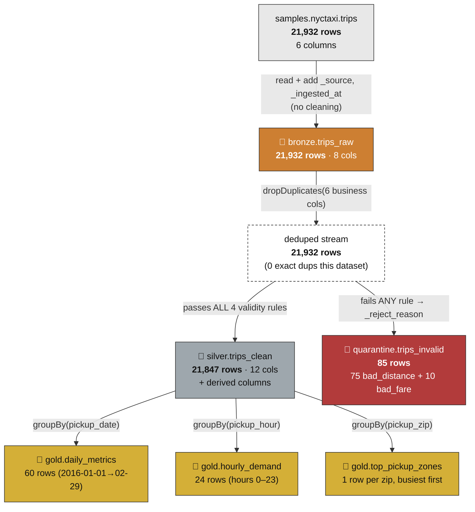

# Data Flow — row-by-row, with real numbers

> Where data **enters**, exactly **what happens** to it at each hop, and where it is **stored**.
> Every count below is from the **verified 2026-07-08 runs** recorded in the M1–M3 specs — so this
> diagram is not aspirational, it's what actually happened.

---

## 1. The flow, with counts

**The accounting always closes:** `21,847 Silver + 85 quarantine = 21,932 deduped`. And every Gold mart
sums back to `21,847` trips. **Nothing is lost, nothing is double-counted, nothing is silently dropped.**
That invariant is the single most important thing to be able to state in a demo.

---

## 2. What each hop does to the data

### 🥉 Bronze — *copy, don't touch*
- **In:** `samples.nyctaxi.trips` (6 columns).
- **Transform:** add **only** provenance — `_source` (where from) and `_ingested_at` (when). **No cleaning.**
- **Out:** `nyc_taxi.bronze.trips_raw`, written `overwrite` (re-running yields the same rows once, never duplicates).
- **Why no cleaning here?** Bronze is the audit trail. If you clean here, you can never prove what the
  source actually contained, and you can't reprocess with a fixed rule later.

### 🥈 Silver — *dedupe, then split valid vs. invalid*
The 6 **business columns** that define a unique trip:
`tpep_pickup_datetime`, `tpep_dropoff_datetime`, `trip_distance`, `fare_amount`, `pickup_zip`, `dropoff_zip`.

1. **Dedupe:** `dropDuplicates(business_cols)` — prevents double-counting revenue downstream.
2. **Validate + split:** one `_reject_reason` column is computed with a **first-failing-rule-wins** cascade:

   | Order | `_reject_reason` | Rule that fails |
   |------:|------------------|-----------------|
   | 1 | `bad_fare` | `fare_amount` is NULL or ≤ 0 |
   | 2 | `bad_distance` | `trip_distance` is NULL or ≤ 0 |
   | 3 | `bad_times` | pickup/dropoff NULL, or dropoff ≤ pickup |
   | 4 | `bad_zip` | `pickup_zip` or `dropoff_zip` is NULL |
   | — | `NULL` (valid) | passed all four → goes to Silver |

   Rows with `_reject_reason = NULL` → **Silver**; the rest → **Quarantine** (with the reason kept).
3. **Derive columns** (on valid rows only), so Gold aggregations are trivial:
   `trip_duration_min`, `pickup_date`, `pickup_hour`, `avg_speed_mph`, `_processed_at`.
4. **Schema enforcement:** Silver is written **without** `overwriteSchema`, so Delta *rejects* any
   accidental schema drift — the declared 12-column contract is the law.

> The verified run found **85 invalid rows (75 `bad_distance`, 10 `bad_fare`)** and **0 exact duplicates**.
> The dedupe step still stays in the design because "0 dups today" is data-dependent, not guaranteed.

### 🥇 Gold — *aggregate to business questions*
Each mart is one `groupBy(grain).agg(metrics)` answering a real question:

| Mart | Grain | Answers | Key metrics |
|------|-------|---------|-------------|
| `daily_metrics` | `pickup_date` | "How do ridership & revenue trend day to day?" | trips, total_revenue, avg_fare, avg_distance, avg_duration_min |
| `hourly_demand` | `pickup_hour` (0–23) | "What are the peak hours?" | trips, avg_fare |
| `top_pickup_zones` | `pickup_zip` | "Which pickup areas drive the most business?" | trips, total_revenue, avg_fare (busiest first) |

---

## 3. Column contract (what's stored where)

| Column | Bronze | Silver | Notes |
|--------|:------:|:------:|-------|
| `tpep_pickup_datetime` | ✅ | ✅ | business key |
| `tpep_dropoff_datetime` | ✅ | ✅ | business key |
| `trip_distance` | ✅ | ✅ | business key; must be > 0 |
| `fare_amount` | ✅ | ✅ | business key; must be > 0 |
| `pickup_zip` / `dropoff_zip` | ✅ | ✅ | business keys |
| `_source` | ✅ | ✅ | provenance (carried through) |
| `_ingested_at` | ✅ | — | Bronze-only ingest stamp |
| `trip_duration_min` | — | ✅ | derived: (dropoff − pickup)/60 |
| `pickup_date` | — | ✅ | derived: `to_date(pickup)` — Gold daily grain |
| `pickup_hour` | — | ✅ | derived: `hour(pickup)` — Gold hourly grain |
| `avg_speed_mph` | — | ✅ | derived: distance / (duration/60) |
| `_processed_at` | — | ✅ | Silver processing stamp |
| `_reject_reason` | — | *(quarantine only)* | why a row was rejected |

---

## 4. Reviewer questions this answers

- *"Prove nothing is lost."* → `Silver (21,847) + quarantine (85) = deduped (21,932)`; each Gold mart sums to 21,847.
- *"Why dedupe on those 6 columns and not a row ID?"* → the source has no stable ID; the business columns *are* the natural key of a trip.
- *"What if two rules fail at once?"* → the cascade assigns the **first** failing reason, so every bad row has exactly one, countable reason.
- *"Where are derived columns created?"* → only in Silver, only on valid rows, so Gold stays a pure aggregation.

See [pipeline-flow.md](pipeline-flow.md) for how this same flow is expressed as one DLT pipeline.
