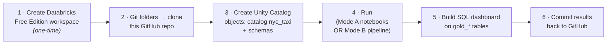
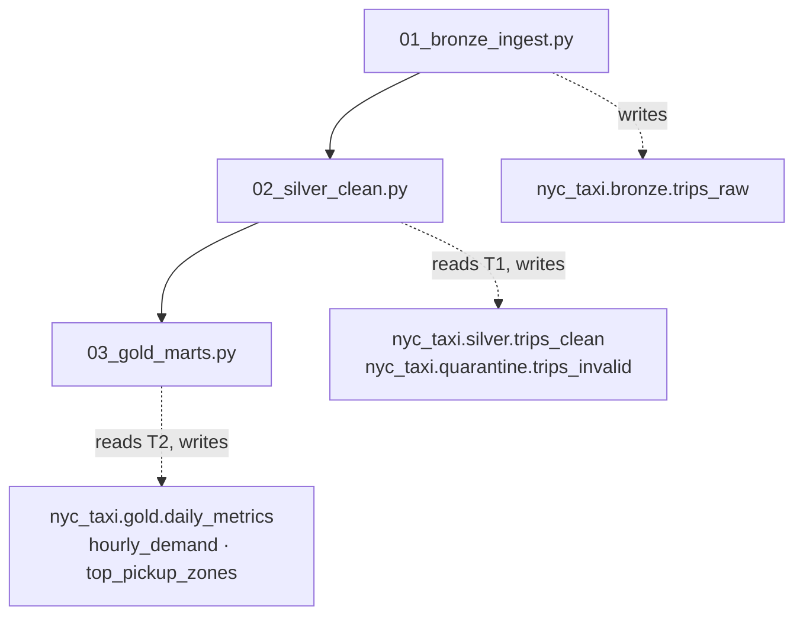
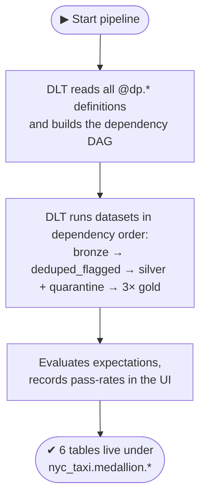

# Execution Flow — the complete lifecycle (start → finish)

> Instruction #5: *"I must always know which file is the entry point, which command starts the project,
> what happens first, what happens next, which modules run in order, and where the pipeline ends."*
> This document answers all of that.

A key thing to say up front in a demo: **this project has no single "run.py".** It runs on the Databricks
platform, so "the entry point" depends on *which* of the two execution modes you mean:

- **Mode A — Development / prototype:** the three notebooks in `src/`, run top-to-bottom in order. This is
  how each layer was figured out and *verified* (M1→M2→M3).
- **Mode B — Production:** the **one DLT pipeline** (`src/pipelines/medallion_pipeline.py`, M4), which
  rebuilds the whole medallion in a single reproducible run.

Both produce the same medallion; Mode B is the reproducible artifact you'd actually operate.

---

## 1. First: the deployment lifecycle (how code gets somewhere it can run)

This is the runbook from [`planning/masterplan.md`](../planning/masterplan.md) §4. Code lives in GitHub;
Databricks **Git folders** mirror the repo into the workspace so there's no copy-paste drift.

---

## 2. Mode A — the notebook execution order (development)

**Entry point:** `src/bronze/01_bronze_ingest.py`. **Command:** open it in the workspace and *Run all*;
then the next; then the next. Order is enforced by the numeric filename prefix (`01_ → 02_ → 03_`).

| Step | File | What happens first → next | Depends on | Produces |
|-----:|------|---------------------------|------------|----------|
| 1 | `01_bronze_ingest.py` | Create catalog+bronze schema → read source → add provenance → write Bronze → verify count matches source | `samples.nyctaxi.trips` | `bronze.trips_raw` |
| 2 | `02_silver_clean.py` | Create silver+quarantine schemas → read Bronze → dedupe → compute `_reject_reason` → split valid/invalid → derive columns → write both → verify accounting closes | `bronze.trips_raw` | `silver.trips_clean`, `quarantine.trips_invalid` |
| 3 | `03_gold_marts.py` | Create gold schema → read Silver → 3× `groupBy().agg()` → write 3 marts → verify each sums to Silver | `silver.trips_clean` | 3 `gold.*` marts |

**Where it ends:** step 3's verification cell prints that all three marts sum to `21,847` — the medallion is built.

**The dependency is strict and one-directional:** you cannot run `02` before `01` (it reads Bronze), nor
`03` before `02` (it reads Silver). This *is* Constitution Principle I ("Bronze → Silver → Gold only") made physical.

---

## 3. Mode B — the DLT pipeline run (production)

**Entry point:** the pipeline definition `src/pipelines/medallion_pipeline.py` (M4).
**Command:** in Databricks, **Jobs & Pipelines → your pipeline → Start** (or a triggered run).

Here you do **not** run datasets in order yourself — you press one button and **DLT** does it:

| Phase | Who does it | Result |
|-------|-------------|--------|
| Resolve | DLT | Parses `@dp.materialized_view` / `@dp.temporary_view` defs, builds the DAG from the `spark.read.table(...)` calls |
| Run | DLT (serverless) | Materializes datasets in the correct order; you never specify the order |
| Enforce | DLT expectations | Drops violating rows, reports pass-rate per rule |
| Finish | — | 6 datasets materialized under `nyc_taxi.medallion`; a clean **full refresh** reproduces them identically |

**Where it ends:** the pipeline UI shows all datasets green with row counts and expectation pass-rates.
The three `gold_*` tables are then ready for the SQL dashboard (M6).

---

## 4. Mode A vs. Mode B — when to use which

| | Mode A — notebooks | Mode B — DLT pipeline |
|--|--------------------|------------------------|
| Purpose | Develop & verify each layer | Reproducible production run |
| Run order | You, via `01→02→03` | DLT, from the declared DAG |
| Data quality | `print`/`display` checks | Native expectations + UI pass-rates |
| Reproducibility | Re-run notebooks (manual) | One full-refresh rebuilds everything |
| Output schema | `bronze` / `silver` / `gold` / `quarantine` | `medallion` (single schema) |
| Milestone | M1–M3 | M4 |

Both are kept on purpose: the notebooks are the *how we got here* record; the pipeline is the *thing you operate*.

---

## 5. Reviewer questions this answers

- *"What's the entry point?"* → notebook `01_bronze_ingest.py` (dev) or the DLT pipeline (prod).
- *"What command starts it?"* → *Run all* on the first notebook, or *Start* on the pipeline.
- *"What runs first / next / last?"* → Bronze → Silver(+quarantine) → Gold; §2 and §3 tables.
- *"Where does it end?"* → the verification cell / the pipeline showing all datasets green + Gold summing to Silver.
- *"Why two modes instead of one?"* → notebooks to *build & prove*, one pipeline to *reproduce* (§4).

See [folder-structure.md](folder-structure.md) for what every file in the repo is and does.
