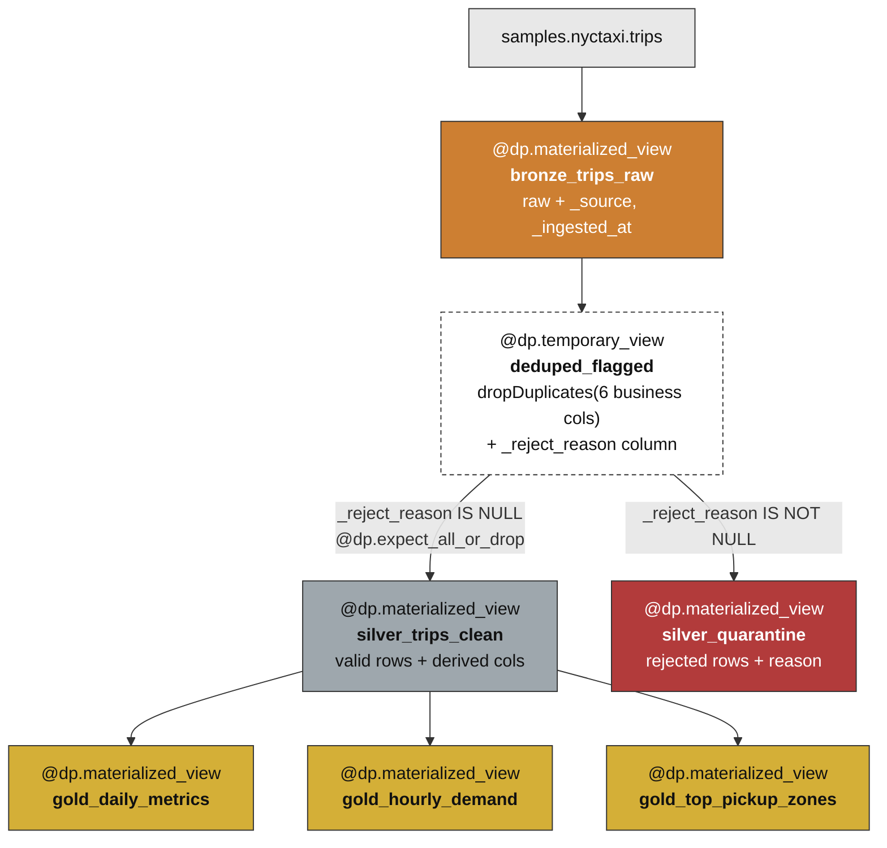

# Pipeline Flow — the M4 DLT dataset graph

> The [data-flow](data-flow.md) view shows *what happens to the rows*. This view shows *how DLT runs it*:
> the six declared datasets, their dependencies, the expectations, and how the quarantine split is
> expressed. This is milestone **M4** (`specs/04-dlt-pipeline.spec.md`), published to
> `nyc_taxi.medallion.*`.

---

## 1. The declarative dataset DAG

In a Lakeflow Declarative Pipeline you **declare datasets and their reads**; DLT infers the dependency
graph and runs them in the right order. You never write "run Bronze, then Silver, then Gold" — you just
say *"Silver reads Bronze"* and DLT figures out the order.



**Why a `temporary_view` in the middle (`deduped_flagged`)?** Both `silver_trips_clean` and `silver_quarantine`
need the *same* deduped-and-flagged rows. Computing that once in a temporary view (not materialized to
storage) avoids doing the dedupe twice and guarantees the two outputs are split from an identical source —
so the accounting always closes. It's a view, not a table, because it's an intermediate, not a deliverable.

---

## 2. Materialized views vs. streaming tables — why MV here

Every dataset is a **materialized view (MV)**: a full recompute from source on each pipeline run.

| Option | What it means | Why (not) for this project |
|--------|---------------|----------------------------|
| **Materialized view** ✅ | Recompute the whole table from its inputs each run. | Chosen. The sample dataset is small and fixed; a full refresh gives **byte-identical, reproducible** Gold every run (Constitution V). Simple to reason about and to demo. |
| **Streaming table** | Incrementally process only *new* rows (append). | Overkill here — there's no continuously arriving data. It's the right tool for Auto Loader / continuous ingestion (noted as future work / project #11), not a fixed sample. |

> **Trade-off to state in a demo:** MV = simplest + fully reproducible, but recomputes everything each run.
> At millions/billions of rows you'd switch Bronze/Silver to **streaming tables** so you only process new
> data. We deliberately chose the simpler option that fits the data size (instruction #8 / YAGNI).

---

## 3. Expectations — data quality as code

Silver carries **DLT expectations** via `@dp.expect_all_or_drop`. This does two jobs at once: it **drops**
violating rows (they don't reach Silver) **and** reports a **pass-rate metric per rule in the pipeline UI**.

```python
@dp.expect_all_or_drop({
    "valid_fare":     "fare_amount IS NOT NULL AND fare_amount > 0",
    "valid_distance": "trip_distance IS NOT NULL AND trip_distance > 0",
    "valid_times":    "tpep_pickup_datetime IS NOT NULL AND tpep_dropoff_datetime IS NOT NULL "
                      "AND tpep_dropoff_datetime > tpep_pickup_datetime",
    "valid_zips":     "pickup_zip IS NOT NULL AND dropoff_zip IS NOT NULL",
})
```

| Expectation | Rule | Verified pass-rate (M2 numbers) |
|-------------|------|---------------------------------|
| `valid_fare` | `fare_amount IS NOT NULL AND fare_amount > 0` | 10 rows fail (`bad_fare`) |
| `valid_distance` | `trip_distance IS NOT NULL AND trip_distance > 0` | 75 rows fail (`bad_distance`) |
| `valid_times` | dropoff > pickup, both non-null | 0 fail |
| `valid_zips` | both zips non-null | 0 fail |

**Why keep a separate `silver_quarantine` table if expectations already drop bad rows?**
`expect_all_or_drop` drops rows and *counts* them, but it doesn't *keep* them. Constitution Principle III
says nothing is silently dropped — so we also materialize the complementary set (rows where
`_reject_reason IS NOT NULL`) into `silver_quarantine`, with the reason, so a human can inspect *what* was
rejected and *why*. Expectations give the **metric**; the quarantine table gives the **evidence**.

**The three expectation modes (know these for the demo):**
| Decorator | On violation | When to use |
|-----------|--------------|-------------|
| `expect` / `expect_all` | keep the row, just **count** it | tracking quality without blocking |
| `expect_or_drop` / `expect_all_or_drop` ✅ | **drop** the row, count it | our Silver — bad rows must not reach trusted layer |
| `expect_or_fail` / `expect_all_or_fail` | **fail the whole run** | when a single bad row means the source is broken |

---

## 4. How this maps to the M1–M3 notebooks

The pipeline is **not new logic** — it re-expresses the *already-verified* notebook logic declaratively:

| Notebook (dev/prototype) | Pipeline dataset (production) |
|--------------------------|-------------------------------|
| `01_bronze_ingest.py` | `bronze_trips_raw` |
| `02_silver_clean.py` (dedupe + split) | `deduped_flagged` (temp view) → `silver_trips_clean` + `silver_quarantine` |
| `03_gold_marts.py` | `gold_daily_metrics`, `gold_hourly_demand`, `gold_top_pickup_zones` |

The notebooks stay as the **development record** (how each layer was figured out and verified); the
pipeline is the **one reproducible production artifact** (Constitution V). Same logic, two forms.

---

## 5. Reviewer questions this answers

- *"Who decides the run order?"* → DLT, from the declared reads. We only declare dependencies.
- *"Why materialized views not streaming?"* → fixed small dataset; full-refresh = reproducible; streaming would be premature (§2).
- *"How is data quality enforced *and* visible?"* → `expect_all_or_drop` drops + reports pass-rates; quarantine keeps the evidence (§3).
- *"What if a rule should just warn, not drop?"* → switch that rule to `expect_all` (§3 table).
- *"Why publish to a separate `medallion` schema?"* → leaves the M1–M3 notebook tables intact for comparison, and gives the production pipeline its own clean namespace.

Next: [execution-flow.md](execution-flow.md) — how you actually *run* all this, start to finish.
